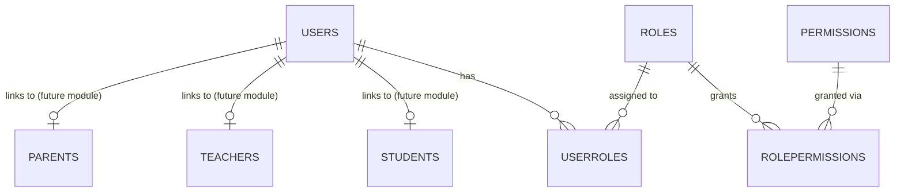

# Module 1: Authentication & Authorization — Database Design

2026-09-17 · @Someone

First module in the build sequence, covering login identity and full RBAC (Decision #3): `Users`, `Roles`, `Permissions`, `UserRoles`, `RolePermissions`.

## Purpose & Scope

This module is the authentication and authorization foundation every other module depends on (per the recommended build order). It covers login identity and full RBAC only — it does NOT include the `Students`, `Teachers`, or `Parents` profile tables (those belong to their own modules and link back here via a `UserId` foreign key).

Decisions this design implements: #1 (no duplicated/embedded data), #3 (full RBAC, not role-column-only).

## Entity List

| Entity | Purpose | PK | Key FKs |
| --- | --- | --- | --- |
| `Users` | One row per login-capable person, any role | Id | — |
| `Roles` | Fixed role catalog: Admin, Supervisor, Clerk, Teacher, Student, Parent | Id | — |
| `Permissions` | Granular action-level rows (e.g. `Student.Create`, `Exam.Publish`) | Id | — |
| `UserRoles` | Many-to-many: a person can hold more than one role | (UserId, RoleId) | UserId→Users, RoleId→Roles |
| `RolePermissions` | Many-to-many: a role's access is data, adjustable without a redeploy | (RoleId, PermissionId) | RoleId→Roles, PermissionId→Permissions |

## Relationship Map

Both junction tables are pure many-to-many: a `User` can hold several `Roles` at once, and a `Role`'s permission set is rows in `RolePermissions`, not hardcoded in application code.

## Schema

### Users

| Column | Type | Null | Key | Notes |
| --- | --- | --- | --- | --- |
| Id | int | N | PK | Identity |
| Username | nvarchar(50) | N | Unique |  |
| Email | nvarchar(100) | N | Unique |  |
| PasswordHash | nvarchar(max) | N |  | Never logged (Serilog rule) |
| Status | nvarchar(20) | N |  | Active / Inactive / Suspended |
| LastLoginAt | datetime2 | Y |  | UTC |
| CreatedAt | datetime2 | N |  | UTC, set by SaveChanges interceptor |
| UpdatedAt | datetime2 | N |  | UTC |
| CreatedBy | int | Y | FK→Users | Nullable for seed/system rows |
| UpdatedBy | int | Y | FK→Users |  |
| IsDeleted | bit | N |  | Soft delete, default 0 |
| DeletedAt | datetime2 | Y |  |  |
| DeletedBy | int | Y | FK→Users |  |

### Roles

| Column | Type | Null | Key | Notes |
| --- | --- | --- | --- | --- |
| Id | int | N | PK |  |
| Name | nvarchar(30) | N | Unique | Admin / Supervisor / Clerk / Teacher / Student / Parent |
| Description | nvarchar(200) | Y |  |  |

### Permissions

| Column | Type | Null | Key | Notes |
| --- | --- | --- | --- | --- |
| Id | int | N | PK |  |
| Name | nvarchar(100) | N | Unique | e.g. `Student.Create`, `Exam.Publish` |
| Module | nvarchar(50) | N |  | Groups permissions by module for admin UI |
| Description | nvarchar(200) | Y |  |  |

Seed data: empty at this module's sign-off. Per Decision #3, the base `Permissions` list is defined per-module as each module's actions are designed — not guessed upfront here.

### UserRoles (junction)

| Column | Type | Null | Key | Notes |
| --- | --- | --- | --- | --- |
| UserId | int | N | PK (composite), FK→Users |  |
| RoleId | int | N | PK (composite), FK→Roles |  |
| AssignedAt | datetime2 | N |  | UTC |

### RolePermissions (junction)

| Column | Type | Null | Key | Notes |
| --- | --- | --- | --- | --- |
| RoleId | int | N | PK (composite), FK→Roles |  |
| PermissionId | int | N | PK (composite), FK→Permissions |  |

## Index Strategy

| Index | Table.Columns | Why |
| --- | --- | --- |
| Unique | `Users.Username` | Login lookup, uniqueness |
| Unique | `Users.Email` | Uniqueness, password-reset lookup |
| Unique | `Roles.Name` | Prevents duplicate role rows |
| Unique | `Permissions.Name` | Prevents duplicate permission rows |
| PK (composite, effectively unique) | `UserRoles(UserId, RoleId)` | Prevents duplicate role grants; also the lookup path for "what roles does this user have" |
| PK (composite, effectively unique) | `RolePermissions(RoleId, PermissionId)` | Prevents duplicate grants; lookup path for "what can this role do" |
| Non-clustered | `UserRoles.RoleId` | Reverse lookup: "who holds this role" (e.g. listing all Teachers) |
| Non-clustered | `Permissions.Module` | Powers a permissions-admin screen grouped by module |

## Audit Strategy

`CreatedAt`/`UpdatedAt` are UTC `datetime2`, set by an EF Core `SaveChanges` interceptor (not a DB default), so app logs (Serilog) and stored timestamps always agree. `CreatedBy`/`UpdatedBy` are nullable `int` FKs to `Users`, nullable to allow seed/system-generated rows. `Users` gets soft delete (`IsDeleted`, `DeletedAt`, `DeletedBy`) since it's referenced by nearly every future table — hard-deleting a user would orphan history everywhere. `Roles`, `Permissions`, and the two junction tables do not need soft delete: they're small reference/config data, not transactional records.

## Forward References (not built in this module)

`Students`, `Teachers`, and `Parents` each get a nullable `UserId` FK to `Users` when their own modules are built (Decision #9: nullable because portal-access-for-every-guardian is still an open business decision). Nothing in those tables is created here — this module ships `Users`/`Roles`/`Permissions`/`UserRoles`/`RolePermissions` only.

## Open Business Decisions (carried into this module)

- Base `Permissions` seed list — defined per-module as each module's actions are designed, not guessed here.
- Whether every Parent/Student gets a `Users` row from day one, or account creation is opt-in (affects whether `UserId` on those future tables is ever *required*).
- Minimum age (if any) for a Student's own portal login.
