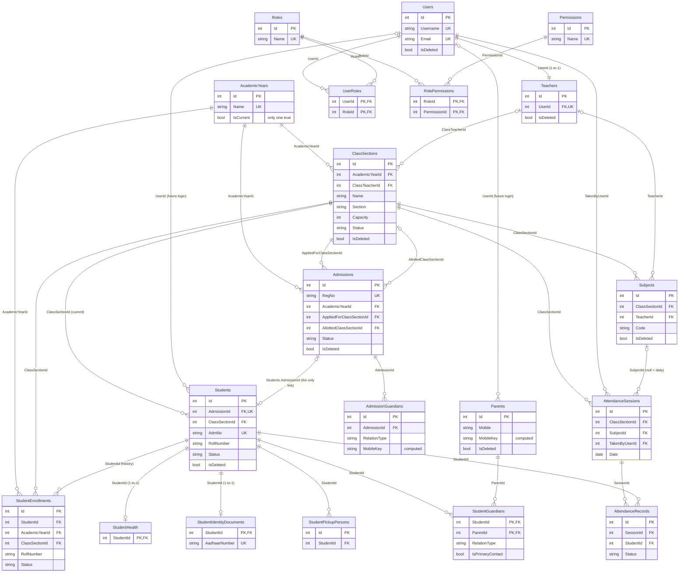
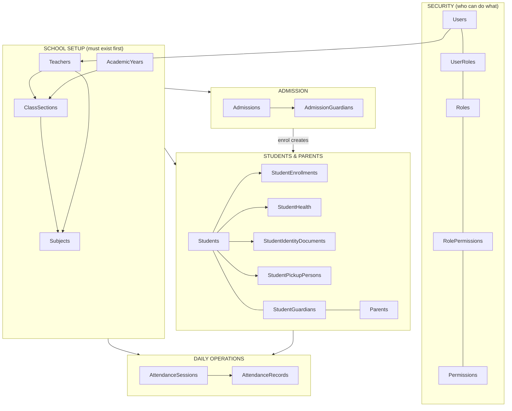

# Database Design & Change-Impact Guide

Source of truth: the EF Core entities and `*Configuration.cs` files as of the migration
`ContractStudentAdmission` (Oct 2026). Tables: **20**. Database: SQL Server.

How to read this document:

1. **ERD** – the picture of every table and link.
2. **Table groups** – what each table is for.
3. **Link register** – every foreign key with its delete behaviour.
4. **Soft delete ripple** – what disappears from queries when a row is soft-deleted.
5. **Uniqueness & constraints** – the rules the database itself enforces.
6. **Impact map** – "if I change X, what breaks?" (read this before touching a table).
7. **Observations** – gaps and oddities found while documenting.

> Render the diagrams in VS Code (Markdown Preview Mermaid Support extension), GitHub, or https://mermaid.live.

---

## 1. ERD

### 1a. Full picture (keys only)

### 1b. The same system as layers (easier to remember)

Read it top-down: **Security** and **School setup** are the foundation. **Admissions** feed
**Students**. **Attendance** needs students, classes, subjects and a user.

---

## 2. Table groups

| Group | Table | Purpose | Soft delete? |
|---|---|---|---|
| Security | `Users` | Login accounts (staff, and later students/parents) | Yes |
| | `Roles` | Admin, Supervisor, Clerk, Teacher, Student, Parent (seeded, ids 1–6) | No |
| | `Permissions` | One row per permission, e.g. `Students.Manage` (seeded, ids 1–11) | No |
| | `UserRoles` | Which roles a user has (many-to-many) | Hidden if user deleted |
| | `RolePermissions` | Which permissions a role has (many-to-many) | No |
| Setup | `AcademicYears` | School years; exactly one has `IsCurrent = 1` | No |
| | `ClassSections` | Class + section for one academic year ("Class 1 A (2026-2027)") | Yes |
| | `Teachers` | Teacher profile, one-to-one with a `Users` row | Yes |
| | `Subjects` | Subject taught in one class section by at most one teacher | Yes |
| Intake | `Admissions` | Application pipeline: Registered → Admitted → Enrolled / Rejected | Yes |
| | `AdmissionGuardians` | Father/mother/guardian written on the application | Hidden if admission deleted |
| People | `Students` | The student's current record | Yes |
| | `StudentEnrollments` | Academic history: one row per class/section period | Hidden if student deleted |
| | `StudentHealth` | Blood group, allergies, medical notes, insurance (1-to-1) | Hidden if student deleted |
| | `StudentIdentityDocuments` | Aadhaar, passport, visa (1-to-1, sensitive) | Hidden if student deleted |
| | `StudentPickupPersons` | People authorised to collect the child | Hidden if student deleted |
| | `Parents` | Parent/guardian people (one row per real person) | Yes |
| | `StudentGuardians` | Link student ↔ parent with relation and primary-contact flag | Hidden if either deleted |
| Daily | `AttendanceSessions` | One roll call: class + date (+ optional subject) | Hidden if class deleted |
| | `AttendanceRecords` | One student's status in one session | Hidden if student or class deleted |

Single source of truth rules (do not duplicate these elsewhere):

- Parent contact data lives **only** in `Parents`. `AdmissionGuardians` is a snapshot of what was typed on the application.
- The student's health lives **only** in `StudentHealth`; identity numbers **only** in `StudentIdentityDocuments`.
- `Students.ClassSectionId` / `RollNumber` is a **mirror of the one Active row** in `StudentEnrollments`. History lives in `StudentEnrollments`.
- The Admission ↔ Student link lives **only** in `Students.AdmissionId`.

---

## 3. Link register (every foreign key)

"Restrict" = the database refuses to delete the parent row while children exist.
"Cascade" = children are deleted with the parent. The application **never hard-deletes**
(it sets `IsDeleted`), so Cascade is only a safety net; Restrict is what protects you if
someone deletes rows by hand in SSMS.

| Child table.column | → Parent table | Delete | Notes |
|---|---|---|---|
| ClassSections.AcademicYearId | AcademicYears | Restrict | |
| ClassSections.ClassTeacherId (nullable) | Teachers | Restrict | One class teacher per section |
| Subjects.ClassSectionId | ClassSections | Restrict | |
| Subjects.TeacherId (nullable) | Teachers | Restrict | One teacher per subject |
| Teachers.UserId (unique) | Users | Restrict | Teacher = a user with profile |
| Admissions.AcademicYearId | AcademicYears | Restrict | |
| Admissions.AppliedForClassSectionId | ClassSections | Restrict | |
| Admissions.AllottedClassSectionId (nullable) | ClassSections | Restrict | Filled at enrolment |
| AdmissionGuardians.AdmissionId | Admissions | Cascade | |
| Students.AdmissionId (nullable, unique) | Admissions | Restrict | **The only Admission↔Student link** |
| Students.ClassSectionId | ClassSections | Restrict | Current class |
| Students.UserId (nullable) | Users | Restrict | Future student login |
| StudentEnrollments.StudentId | Students | Restrict | |
| StudentEnrollments.AcademicYearId | AcademicYears | Restrict | |
| StudentEnrollments.ClassSectionId | ClassSections | Restrict | |
| StudentHealth.StudentId (PK) | Students | Cascade | 1-to-1 |
| StudentIdentityDocuments.StudentId (PK) | Students | Cascade | 1-to-1 |
| StudentPickupPersons.StudentId | Students | Cascade | |
| Parents.UserId (nullable) | Users | Restrict | Future parent login |
| StudentGuardians.StudentId | Students | Cascade | Composite PK (StudentId, ParentId) |
| StudentGuardians.ParentId | Parents | Cascade | |
| AttendanceSessions.ClassSectionId | ClassSections | Restrict | |
| AttendanceSessions.SubjectId (nullable) | Subjects | Restrict | null = daily attendance |
| AttendanceSessions.TakenByUserId | Users | Restrict | |
| AttendanceRecords.SessionId | AttendanceSessions | Cascade | |
| AttendanceRecords.StudentId | Students | Restrict | Points at the student, not the enrollment |
| UserRoles.UserId / RoleId | Users / Roles | Cascade | Composite PK |
| RolePermissions.RoleId / PermissionId | Roles / Permissions | Cascade | Composite PK |
| Users.CreatedBy / UpdatedBy / DeletedBy | Users | NoAction | Self-references |

Many-to-many relationships: **Users ↔ Roles**, **Roles ↔ Permissions**, **Students ↔ Parents**
(with relation type), and **Teachers ↔ Subjects** is one-to-many (a subject has one teacher).

---

## 4. Soft delete ripple (query filters)

Every table with `IsDeleted` has an EF **global query filter**, and child tables inherit the
filter from their parent. So setting `IsDeleted = 1` on one row makes related rows invisible
to the app **without deleting them**.

| If you soft-delete… | …these disappear from every query |
|---|---|
| **Student** | StudentEnrollments, StudentHealth, StudentIdentityDocuments, StudentPickupPersons, StudentGuardians, AttendanceRecords |
| **Parent** | StudentGuardians (the link rows) |
| **Admission** | AdmissionGuardians |
| **ClassSection** | AttendanceSessions, AttendanceRecords, Subjects of that class |
| **Subject** | The subject itself (attendance sessions keep their SubjectId) |
| **User** | Teachers row of that user, UserRoles |
| **Teacher** | The teacher; the app also soft-deletes the linked User in the same save |

Consequence: a hand-run SQL query in SSMS will still show these rows (SSMS has no filter).
That is why the data check earlier showed deleted rows.

Delete guards enforced by the application (otherwise the delete returns 409):

| Delete | Blocked while… |
|---|---|
| ClassSection | it has students, admissions or subjects (message says "Mark it Inactive instead") |
| Teacher | assigned to any subject or class teacher of any class |
| Admission | **no guard** (see Observations) |
| Student, Parent, Subject | no guard |

---

## 5. Uniqueness & constraints enforced by the database

| Table | Rule | Type |
|---|---|---|
| AcademicYears | `Name` unique | Unique index |
| AcademicYears | Only one row with `IsCurrent = 1` | Filtered unique index |
| ClassSections | (`AcademicYearId`, `Name`, `Section`) unique among non-deleted | Filtered unique |
| ClassSections | `Floor` is null or ≥ 0 | Check |
| Subjects | (`Code`, `ClassSectionId`) unique among non-deleted | Filtered unique |
| Teachers | `UserId` unique | Unique |
| Users | `Username`, `Email` unique; `Status` in Active/Inactive/Suspended | Unique + check |
| Roles / Permissions | `Name` unique | Unique |
| Admissions | `RegNo` unique | Unique |
| AdmissionGuardians | At most one `IsPrimaryContact = 1` per admission | Filtered unique |
| AdmissionGuardians | `RelationType` in Father/Mother/Guardian | Check |
| Students | `AdmNo` unique | Unique |
| Students | (`ClassSectionId`, `RollNumber`) unique (**includes left and soft-deleted students**) | Unique |
| Students | `AdmissionId` unique (one student per admission) | Unique |
| StudentEnrollments | **One Active row per student** | Filtered unique (`Status = 'Active'`) |
| StudentEnrollments | (`ClassSectionId`, `RollNumber`) unique among Active rows | Filtered unique |
| StudentEnrollments | `Status` in Active/Promoted/Repeated/Transferred/Left; Active ⇔ `EndDate` null; closed ⇒ `EndDate ≥ StartDate` | Checks |
| StudentIdentityDocuments | `AadhaarNumber` unique when present; 12 digits | Filtered unique + check |
| StudentGuardians | At most one primary contact per student; `RelationType` check | Filtered unique + check |
| AttendanceSessions | One daily session per (class, date); one per (class, date, subject) | Two filtered uniques |
| AttendanceRecords | One record per (session, student); `Status` check | Unique + check |
| Parents / AdmissionGuardians | `MobileKey` = digits-only copy of `Mobile` (**computed, stored**) | Computed column + index |

---

## 6. Impact map: "If I change X, what breaks?"

Risk: 🔴 high (data or many screens), 🟠 medium, 🟢 low.

### 6a. Changing columns, values or names

| You change… | Risk | What breaks / what to update |
|---|---|---|
| `ClassSections.Name`, `Section`, or the academic-year name | 🟠 | Display name `"Class 1 A (2026-2027)"` is built in **one place**: `ClassSection.BuildDisplayName`. It is used in admissions, students, subjects, teachers, attendance. Change it there only. The frontend filter dropdowns match on this text. |
| `Students.Status` values (Active / Inactive / Left) | 🔴 | Attendance roster counts only `Active`; `CountActiveStudentsAsync` (class capacity) counts only `Active`; the enrollment sync in `StudentService.UpdateAsync` keys off `Left`; the React status filter and `StudentStatus` type. |
| `EnrollmentStatuses` constants | 🔴 | Constants are repeated as **text** in the check constraint `CK_StudentEnrollments_Status` and in the filtered-index filters (`[Status] = 'Active'`). A new status needs a migration that changes the constraint. Renaming `Active` breaks both unique indexes. |
| `Admissions.Status` values | 🟠 | `RequireStatus(...)` checks in `AdmissionService`, the React pipeline tabs, row-action visibility (confirm/enrol/reject). |
| `StudentEnrollments` rows | 🔴 | Never edit by hand. `Students.ClassSectionId/RollNumber` must equal the Active row. Future Fees and Exams will reference the enrollment, so history must stay intact. |
| `Students.ClassSectionId` or `RollNumber` directly | 🔴 | Bypasses history. Always change through `PUT /api/students/{id}` so a new enrollment is written. |
| `Parents.Mobile` format or `MobileKeySql` expression | 🟠 | Guardian matching at enrolment compares `MobileKey` (digits only). Changing the expression changes the computed column in both `Parents` and `AdmissionGuardians`; requires a migration. |
| `StudentGuardians` primary flag | 🟢 | Filtered unique index allows at most one primary per student. Move it with `POST /api/parents/{id}/students/{studentId}/primary` (not by editing rows). |
| `Permissions.Name` | 🔴 | The name is copied into the **JWT** and checked by `RequireClaim` in `Program.cs`, `[Authorize(Policy=…)]` on controllers and `User.HasClaim("permission", …)`. Renaming requires changes in all three plus seed data, and every user must log in again. |
| `Permissions.Id` / `RolePermissions` seed | 🟠 | Seed is in `ApplicationDbContext.OnModelCreating`. Duplicate Ids cause the earlier "same key value for {'Id'}" migration error. Never reuse an Id. |
| `Roles.Name` | 🟠 | `TeacherService` looks up the role named `"Teacher"`; `UserService` looks up by the role name in the request; JWT carries role names. |
| `Teachers.UserId` | 🟠 | Attendance finds "which teacher is this user" via this link to decide who may mark attendance. |
| `ClassSections.ClassTeacherId` / `Subjects.TeacherId` | 🟠 | Attendance permissions (daily = class teacher; subject = subject teacher). Teacher delete is blocked while either is set. |
| `AcademicYears.IsCurrent` | 🟠 | Class-section create with no year uses the current year; the filtered unique index permits only one current year. There is **no screen/API** for academic years yet (only the seeded 2026-2027). |
| `Admissions.AdmissionFee` | 🟢 | One fee concept. Future Fees module should read this, not add a second fee column. |
| Sensitive columns (Aadhaar/passport/visa) | 🟠 | Masked in `StudentService` via `SensitiveDataMasker`; only `Students.ViewSensitive` sees full values; the identity PUT requires both Manage and ViewSensitive. |

### 6b. Removing or hard-deleting rows

| Action | What happens |
|---|---|
| Delete a `ClassSection` row in SSMS | Blocked by Restrict if any admission, student, enrollment, subject or attendance session references it. |
| Delete a `Student` row in SSMS | Blocked by Restrict from StudentEnrollments and AttendanceRecords. Cascade would remove health, identity, pickup persons and guardian links. |
| Delete an `Admission` row | Blocked if a Student has `AdmissionId` pointing at it. Cascade removes its guardians. |
| Delete a `Parent` row | Cascade removes all StudentGuardians links of that parent. |
| Delete a `User` row | Blocked by Restrict if it is a Teacher, a student/parent login, or took attendance. Cascade removes UserRoles. |
| Delete a `Role` row | Cascade removes UserRoles and RolePermissions: **users silently lose access.** |
| Delete a `Permission` row | Cascade removes the RolePermissions: the permission disappears from every role. |

### 6c. Adding something new – what it should link to

| New module | Must link to | Why |
|---|---|---|
| Fees | `StudentEnrollments.Id` (not only `Students.Id`) | Invoices belong to the academic year/class the student was in, even after they move. |
| Exams / Results | `StudentEnrollments.Id`, `Subjects.Id`, `AcademicYears.Id` | "Class 6 results" must stay tied to Class 6 after promotion. |
| Timetable | `ClassSections.Id`, `Subjects.Id`, `Teachers.Id` | Same ownership as attendance. |
| Student/Parent login | `Students.UserId` / `Parents.UserId` (already present) + roles 5/6 | Columns exist; no creation flow yet. |
| Promotion | `StudentEnrollments` (close as Promoted / Repeated, open next year) | Rule already designed; endpoint not built. |
| Audit | All tables: `CreatedAt/UpdatedAt/CreatedBy/UpdatedBy` | Interceptor currently stamps only `Users`; child tables rely on SQL defaults. |

### 6d. Safe-change checklist

1. Find every use: search the solution for the property or constant name (also search the frontend `types/` folder).
2. Is it repeated as text in a configuration (check constraint, filtered index, computed column)? Update it and add a migration.
3. Does the JWT or a policy use it? Users must log in again afterward.
4. Take a database backup before any migration that drops or renames a column.
5. Run the Swagger test cases in `swagger-test-cases.md` for the affected module.

---

## 7. Observations (gaps found while documenting)

These are facts about the current code, not new decisions. Each is a candidate for the backlog.

| # | Finding | Impact |
|---|---|---|
| 1 | `DELETE /api/admissions/{id}` has no guard: an **Enrolled** admission can be soft-deleted while its student still points at it. | The student's admission registration number would no longer resolve. Suggested: block delete when `Status = Enrolled`. |
| 2 | Parent form labels Email "unique when set", but the database and `ParentService` do **not** enforce email uniqueness. | Duplicate parent emails are allowed today. Decide: enforce or fix the label. |
| 3 | `Students` unique index (`ClassSectionId`, `RollNumber`) still counts Left and soft-deleted students. | A roll number of a student who left stays "taken". The enrollment table's index is correct (Active only). |
| 4 | `Student.CreatedAt/UpdatedAt/CreatedBy/UpdatedBy` are not stamped (interceptor handles only `Users`). Child tables use SQL `SYSUTCDATETIME()` defaults only for insert time. | Fixed by the planned audit interceptor. |
| 5 | `AttendanceRecords` has no audit columns. | Only the session carries who/when. |
| 6 | Permission `ClassSections.Create` (id 2) and `ClassSections.Manage` (id 7) both exist; only `Manage` is used by controllers. | `ClassSections.Create` is unused. |
| 7 | No API for AcademicYears, Roles, Permissions or role-permission assignment. | Only seed data exists. |
| 8 | `frontend/.../students/components/CreateStudentModal.tsx` is a leftover file (replaced by `StudentModal.tsx`). | Dead code; safe to delete. |
| 9 | Navigation lists modules that do not exist yet (Reports, Assets, Timetable, …); their routes redirect to the dashboard. | Cosmetic. |
