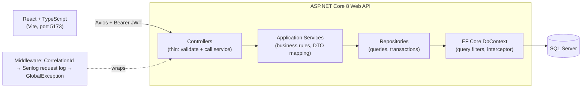
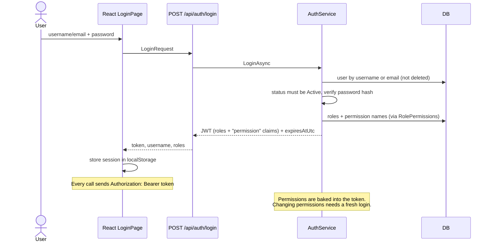
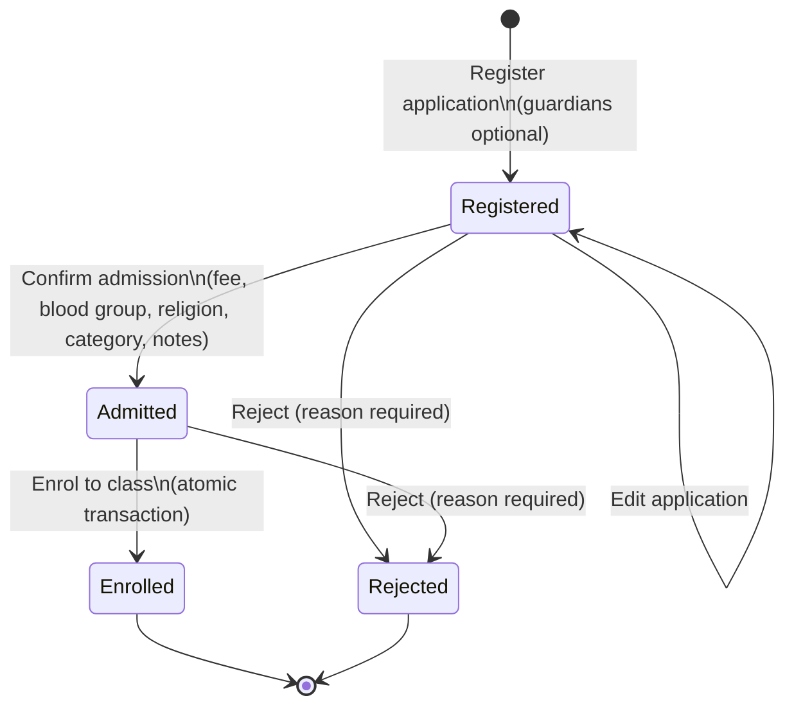
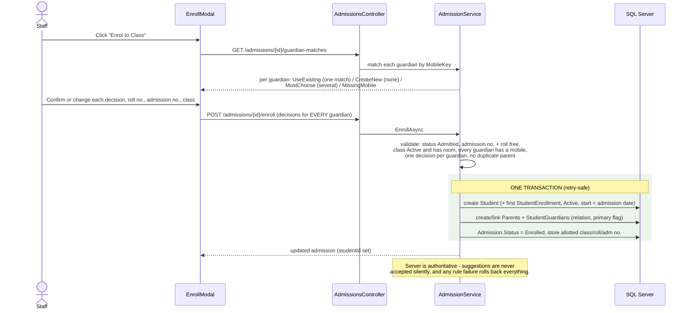
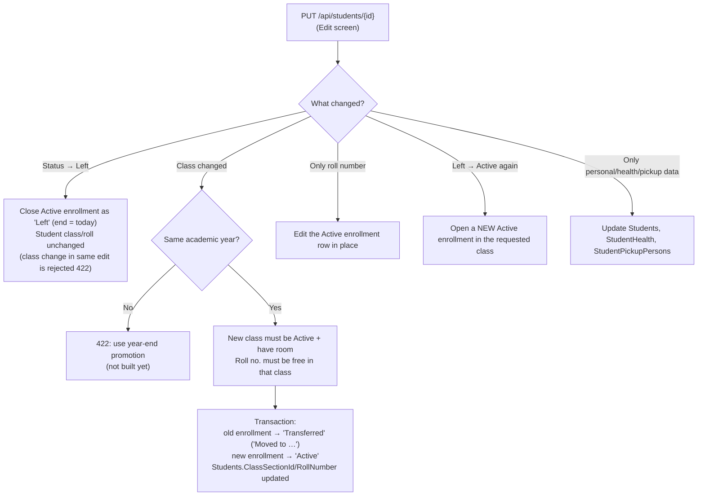
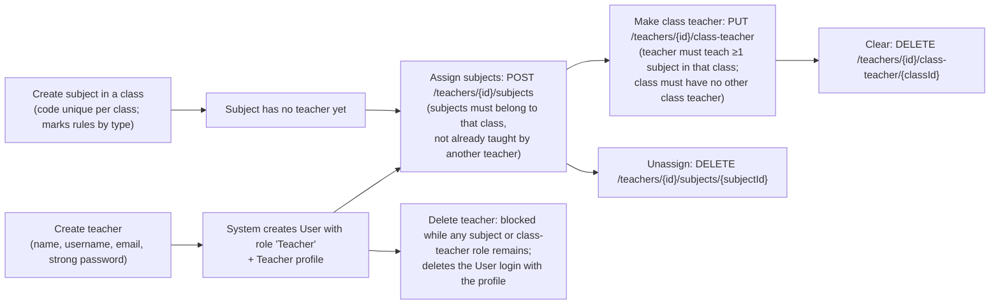
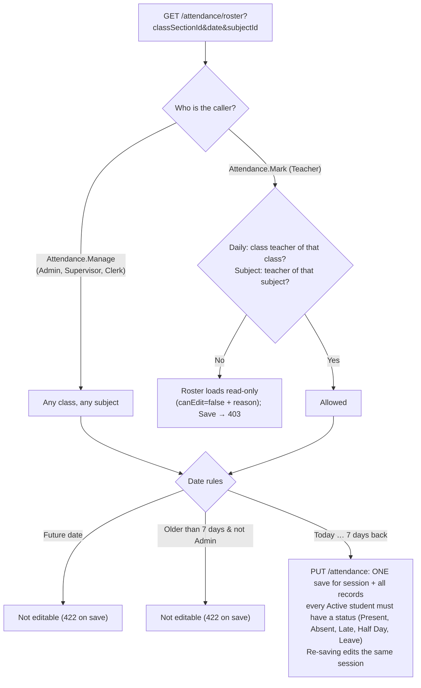
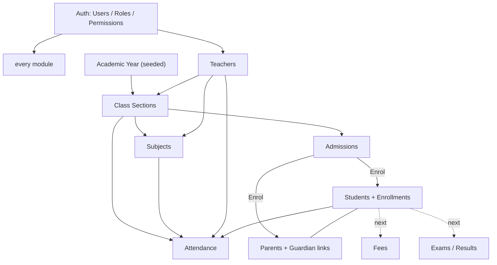

# System Flows — What We Have Built

Covers: overall architecture, authentication, and one flow per module. Every flow below
matches the code as of migration `ContractStudentAdmission`.

---

## 1. Overall architecture

Request pipeline details:

1. `CorrelationIdMiddleware` gives every request a trace id (returned in error bodies and logs).
2. JWT bearer authentication. **Fallback policy = authenticated user required** for every endpoint, except `POST /api/auth/login`.
3. Controller: FluentValidation → on failure **400 `VALIDATION_ERROR`** with per-field `errors`.
4. Service throws `NotFoundException` (404), `ConflictException` (409), `ForbiddenException` (403), `BusinessRuleException` (422).
5. `GlobalExceptionMiddleware` turns exceptions into the standard body
   `{ success:false, message, errorCode, errors?, traceId }`. 401 and 403 from the auth layer use the same body.
6. Frontend: `apiClient` attaches the token; a 401 clears the session and redirects to `/login`; `getApiErrors` + `ValidationModal` show messages.

Layering rule: Controller → Service → Repository → EF Core. No business logic in controllers.

---

## 2. Authentication & permissions

Seeded roles and permissions:

| Permission | Admin | Supervisor | Clerk | Teacher | Used by |
|---|:-:|:-:|:-:|:-:|---|
| Users.Create | ✔ | | | | `POST /api/users` |
| ClassSections.Manage | ✔ | | | | create/edit/status/delete class sections |
| ClassSections.Create | ✔ | | | | (unused by controllers) |
| Admissions.Manage | ✔ | | | | every write on admissions |
| Students.Manage | ✔ | | | | create/edit/delete student |
| Students.ViewSensitive | ✔ | ✔ | | | see full Aadhaar/passport/visa; edit identity |
| Parents.Manage | ✔ | | | | parents + guardian links |
| Subjects.Manage | ✔ | | | | subjects |
| Teachers.Manage | ✔ | | | | teachers + assignments |
| Attendance.Manage | ✔ | ✔ | ✔ | | mark attendance for any class |
| Attendance.Mark | | | | ✔ | mark own class/subject only |

Roles Student (5) and Parent (6) exist but have **no permissions and no login flow yet**.

Reads (`GET`) need only a valid login, except the guardian-matches endpoint (Admissions.Manage).

---

## 3. Module flows

### 3.1 Class Sections

- **Create**: name + section + stage/medium/stream + capacity (1–200). Year defaults to the current academic year if not sent. Duplicate (year, name, section) → 409.
- **Edit**: capacity cannot go below the current number of Active students → 409.
- **Activate / deactivate**: `PATCH /status`. Inactive classes refuse new admissions and students.
- **Delete** (soft): blocked while students, admissions or subjects exist → 409 "Mark it Inactive instead".
- Responses include `enrolled` (count of Active students) and the display name `"Class 1 A (2026-2027)"`.

### 3.2 Admissions (pipeline)

Rules:

- Register needs: names, gender, DOB in the past, applied-for class (must be Active), type `New`/`Transfer`, phone. Guardians optional (max 5, ≤1 father, ≤1 mother, ≤1 primary).
- Edit: guardians are replaced as a set; once Enrolled the guardian list is left untouched.
- Confirm: only from Registered. Fee ≥ 0.
- Enrol: only from Admitted. See next diagram.
- Reject: only from Registered or Admitted; reason required (≤300 chars).
- Delete (soft): anytime — **no guard** (documented gap).

### 3.3 Enrolment (the most important transaction)

### 3.4 Students & academic history

- **List** (`GET /api/students`) returns summaries; **detail** (`GET /api/students/{id}`) returns health, identity (masked unless `Students.ViewSensitive`), pickup persons, guardians.
- **Identity** is saved separately: `PUT /api/students/{id}/identity` (needs Students.Manage **and** Students.ViewSensitive; Aadhaar 12 digits, unique).
- **History**: `GET /api/students/{id}/enrollments` newest first (UI: 📚 button).
- **Standalone create** (`POST /api/students`) also creates the first enrollment.
- **Delete** soft-deletes the student; no guard.

### 3.5 Parents & guardian links

- Create/edit parent (name, mobile required; notification preferences; work and address info).
- Link a parent to a student from either side: `POST /api/parents/{id}/students` or `POST /api/students/{id}/guardians` (relation Father/Mother/Guardian, primary flag). Duplicate link → 409.
- Make primary: `POST /api/parents/{id}/students/{studentId}/primary`.
- Unlink: `DELETE …/students/{studentId}` (or `…/guardians/{parentId}`).
- Parent is the single source of truth for contact data. Several parents may share one mobile (siblings' parents entered twice) — that is why matching never auto-merges.

### 3.6 Teachers, subjects, class teacher

- Subject types: `Theory` / `Practical` need Max + Pass marks; `Both` needs Theory and Practical max + pass.
- Teacher status: Active / Inactive / Suspended (`PATCH /teachers/{id}/status`). A non-Active user cannot log in.

### 3.7 Attendance

- Daily session (no subject) and subject sessions are separate; each unique per date.
- Roster = Active students of the class plus anyone already recorded that day.
- History: `GET /attendance/students/{id}?from&to`. Class summary: `GET /attendance/summary?classSectionId&from&to` (max 366 days).
- Percentage: Present = 1, Late = 1, Half Day = 0.5, Absent = 0; Leave excluded from the denominator.
- UI helpers: Mark All Present, Copy Previous Day, unsaved-changes warning, last-7-sessions dots.

### 3.8 Users

- `POST /api/users` (Users.Create): username, email, strong password, role name. Duplicate username/email → 409. There is no user list/edit screen yet.

---

## 4. How the modules depend on each other

Build order we followed: Auth → Class Sections → Subjects → Teachers → Attendance → Admissions → Students → Parents → Student/Admission redesign → Academic history. Solid arrows = built; dotted = planned.

---

## 5. Module status matrix

| Module | Screens | DB | Service | API | Frontend | Unit/integration tests | Status |
|---|---|---|---|---|---|---|---|
| Auth + Users | Login, Dashboard (welcome only) | ✔ | ✔ | login, create user | ✔ | ✔ (13 backend tests: auth, users, validators, hasher) | Done (no user admin screen) |
| Class Sections | list, modal | ✔ | ✔ | 6 endpoints | ✔ | none | Done, tests pending |
| Subjects | list, modal | ✔ | ✔ | 5 endpoints | ✔ | none | Done, tests pending |
| Teachers | list, modal, manage modal | ✔ | ✔ | 11 endpoints | ✔ | none | Done, tests pending |
| Attendance | roster, history, summary | ✔ | ✔ | 4 endpoints | roster screen | none | Done, tests pending |
| Admissions | pipeline, 4 modals | ✔ | ✔ | 9 endpoints | ✔ | none | Done, awaiting full-day test |
| Students | list, modal, parents, history | ✔ | ✔ | 10 endpoints | ✔ | none | Done, awaiting full-day test |
| Parents | list, modal, link modal | ✔ | ✔ | 9 endpoints | ✔ | none | Done, tests pending |
| Academic history | 📚 modal | ✔ | ✔ | 1 endpoint | ✔ | none | Read-only built; correction + promotion pending |
| Audit interceptor | — | n/a | — | — | — | — | Next |
| Fees, Exams/Results, Timetable, Users/Roles admin | — | — | — | — | — | — | Not started |

The test column reflects the files in `SchoolManagement.Tests`: only Auth/Users (unit + integration), the login/create-user validators and the password hasher are covered. Every other module still needs tests; no frontend tests exist yet.
